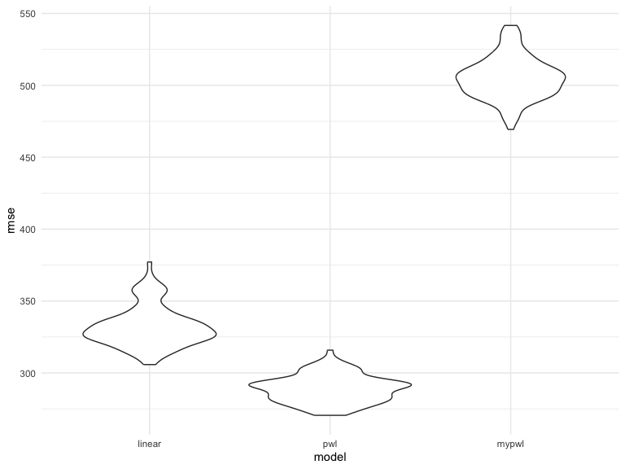

Homework 6
================
Linshen Cai

## Problem3

``` r
# Data Preprocessing
birthweight <- read_csv("./data/birthweight.csv") %>%
  mutate(
    babysex = factor(ifelse(babysex == 1, "male", "female")),
    frace = factor(case_when(
      frace == 1 ~ "White",
      frace == 2 ~ "Black",
      frace == 3 ~ "Asian",
      frace == 4 ~ "Puerto Rican",
      frace == 8 ~ "Other",
      frace == 9 ~ "Unknown")),
    malform = factor(ifelse(malform == 0, "absent", "present")),
    mrace = factor(case_when(
      mrace == 1 ~ "White",
      mrace == 2 ~ "Black",
      mrace == 3 ~ "Asian",
      mrace == 4 ~ "Puerto Rican",
      mrace == 8 ~ "Other"
    ))
  )
```

    ## Rows: 4342 Columns: 20
    ## ── Column specification ────────────────────────────────────────────────────────
    ## Delimiter: ","
    ## dbl (20): babysex, bhead, blength, bwt, delwt, fincome, frace, gaweeks, malf...
    ## 
    ## ℹ Use `spec()` to retrieve the full column specification for this data.
    ## ℹ Specify the column types or set `show_col_types = FALSE` to quiet this message.

``` r
# Model Fitting
my_lm <- lm(bwt ~ fincome * menarche + fincome * momage + menarche * momage, data = birthweight)
tidy_results <- tidy(my_lm) %>% select(term, estimate, p.value)
residual_plot <- ggplot(add_residuals(birthweight, my_lm), aes(x = bwt, y = resid)) + geom_point()

# Cross-Validation
cv_df <- crossv_mc(birthweight, 100) %>%
  mutate(
    train = map(train, as_tibble),
    test = map(test, as_tibble),
    linear_mod = map(train, ~lm(bwt ~ blength + gaweeks, data = .)),
    pwl_mod = map(train, ~lm(bwt ~ bhead * blength + bhead * babysex + blength * babysex, data = .)),
    mypwl_mod = map(train, ~lm(bwt ~ fincome * menarche + fincome * momage + menarche * momage, data = .))
  ) %>%
  mutate(
    rmse_linear = map2_dbl(linear_mod, test, ~rmse(model = .x, data = .y)),
    rmse_pwl = map2_dbl(pwl_mod, test, ~rmse(model = .x, data = .y)),
    rmse_mypwl = map2_dbl(mypwl_mod, test, ~rmse(model = .x, data = .y))
  )

# Visualization of Cross-Validation Results
cv_violin_plot <- cv_df %>%
  select(starts_with("rmse")) %>%
  pivot_longer(
    everything(),
    names_to = "model",
    values_to = "rmse",
    names_prefix = "rmse_"
  ) %>%
  mutate(model = fct_inorder(model)) %>%
  ggplot(aes(x = model, y = rmse)) + geom_violin()

# Display Results
print(tidy_results %>% knitr::kable(digit = 3))
```

    ## 
    ## 
    ## |term             | estimate| p.value|
    ## |:----------------|--------:|-------:|
    ## |(Intercept)      | 2448.254|   0.000|
    ## |fincome          |    1.424|   0.626|
    ## |menarche         |   20.765|   0.415|
    ## |momage           |   39.487|   0.019|
    ## |fincome:menarche |    0.101|   0.631|
    ## |fincome:momage   |   -0.016|   0.837|
    ## |menarche:momage  |   -1.957|   0.127|

``` r
print(residual_plot)
```


``` r
print(cv_violin_plot)
```



Preprocessing the birthweight information, which involves recoding
certain categories and transforming categorical variables to factors, is
the first step in the modeling process. Next, a linear regression model
is fitted to predict the birth weight by taking into account the
interactions between the mother’s age, menarche, and financial income.
Extracted model coefficients, estimates, and p-values are shown in a
tabular manner. A scatter plot is utilized to visualize residuals. Then,
three models are evaluated using 100 iterations of cross-validation: one
with basic predictors, one with extra interactions, and one with the
original interaction terms. The violin shape for the distribution of
RMSE for each model is plotted. The pwl model has the smallest rmse and
variance.
